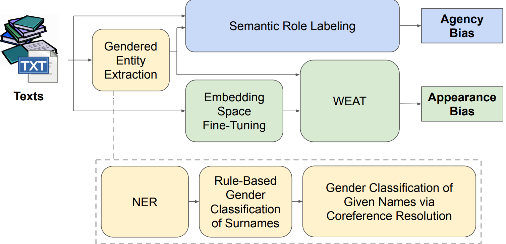

# Female_Objectification_Quantifying_in_Novels
This Repository is code for our paper: Reflecting the Male Gaze: Quantifying Female Objectification in 19th and 20th Century Novels.

## Data Introduction
The novel list used in our study comes from the 100 most popular downloaded books from [Project Gutenberg] as of August 25, 2023. We selected the novels which were published after 1800 and were written in or translated into English. Our final dataset consists of 79 novels, with `novel_79_list.txt` showing the titles of them.

[Project Gutenberg]: https://www.gutenberg.org/ebooks/search/?sort_order=downloads

## Model

